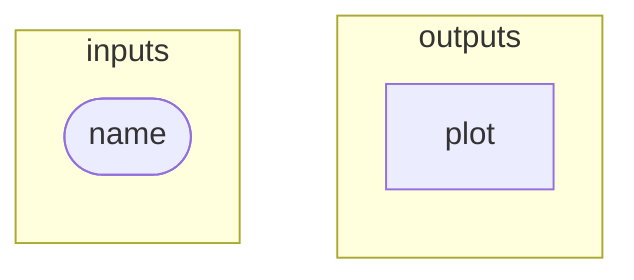
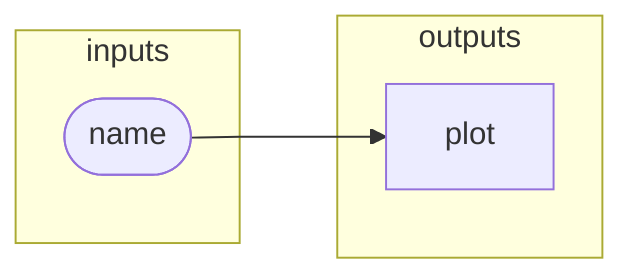
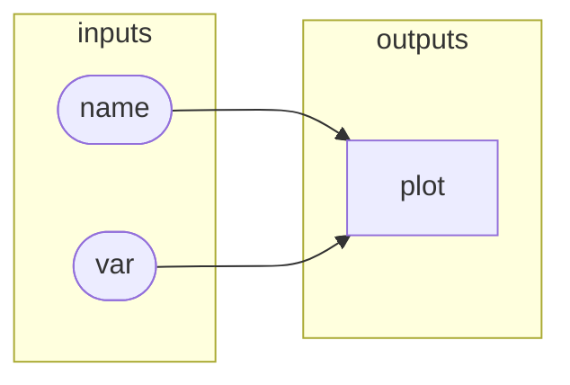
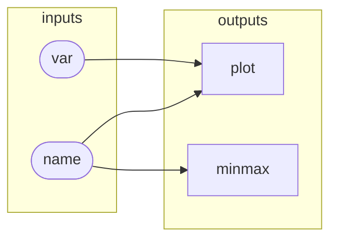
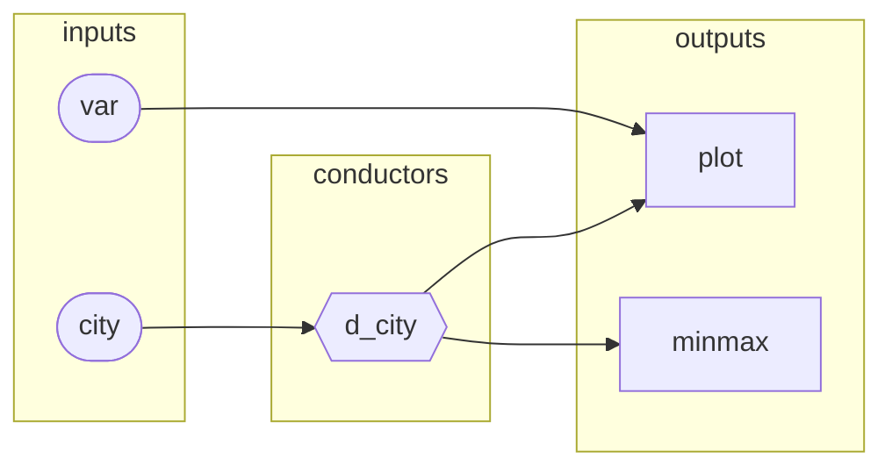
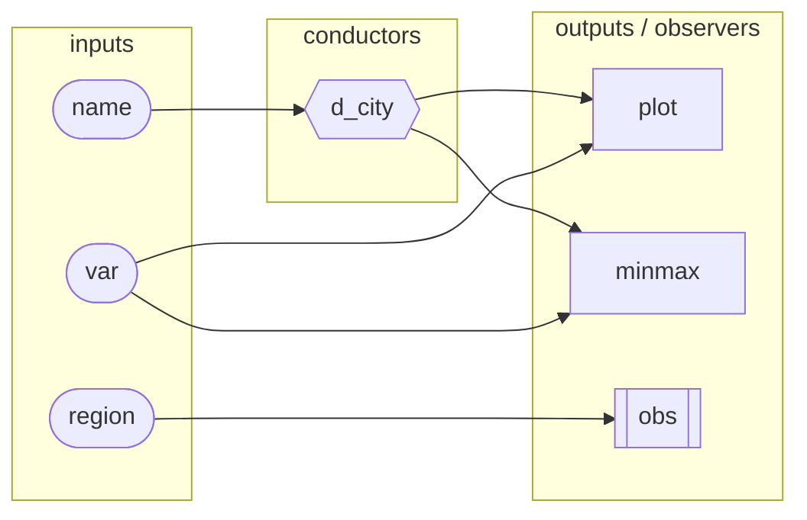
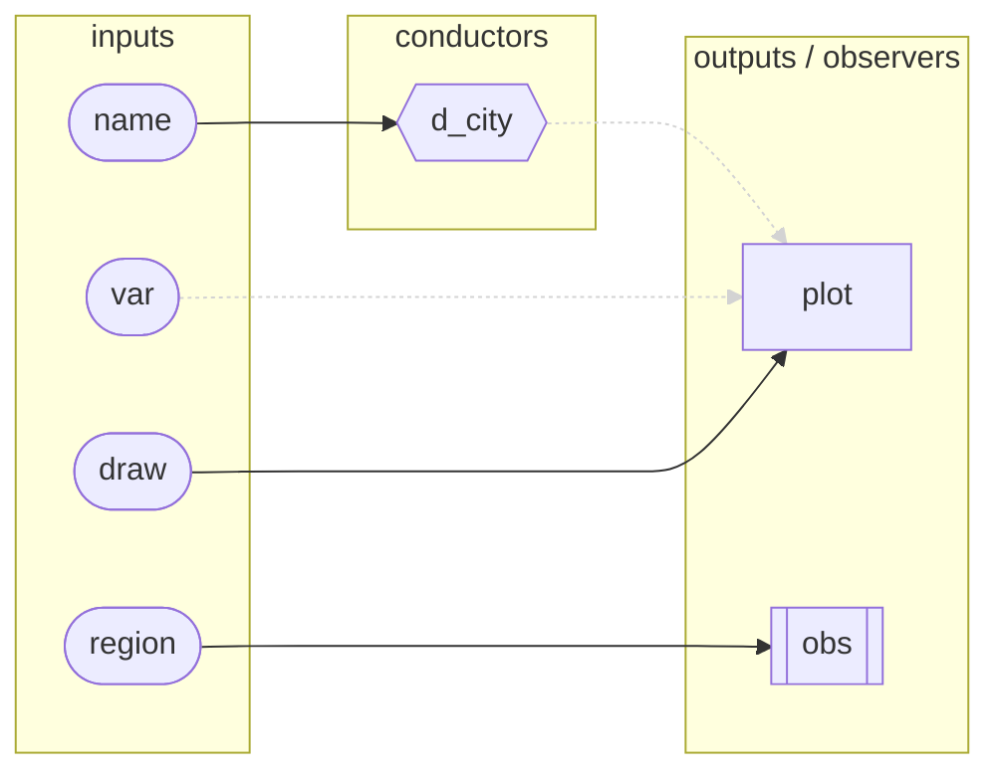

## Fig 1

```mermaid
flowchart LR
subgraph outputs
n2[plot]
end
subgraph inputs
n1([name]) 
end
n1 ~~~ n2
```

## Fig 2

```mermaid
flowchart LR
subgraph outputs
n2[plot]
end
subgraph inputs
n1([name]) 
end
n1 --> n2
```

## Fig 3

```mermaid
flowchart LR
subgraph outputs
out1[plot]
end
subgraph inputs
in1([name]) 
in2([var]) 
end
in1 & in2 --> out1
```

## Fig 4

```mermaid
flowchart LR
subgraph outputs
out1[plot]
out2[minmax]
end
subgraph inputs
in1([name]) 
in2([var]) 
end
in1 & in2 --> out1
in1 --> out2
```

## Fig 5

```mermaid
flowchart LR
  subgraph outputs
  out1[plot]
  out2[minmax]
  end
  subgraph conductors
  react1{{d_city}}
  end
  subgraph inputs
  in1([city]) 
  in2([var])
  end
  in1 --> react1
  react1 --> out1 & out2
  in2 --> out1
```

## Fig 6

```mermaid
flowchart LR

  subgraph outputs / observers
    out1[plot]
    out2[minmax]
    obs1[[obs]]
  end
  
  subgraph conductors
    react1{{d_city}}
  end
  
  subgraph inputs
    direction TB
    in0([region])
    in1([name]) 
    in2([var])
  end

  in0 --> obs1
  in1 --> react1
  react1 --> out1 & out2
  in2 --> out1 & out2
```

## Fig 7

```mermaid
flowchart LR

  subgraph outputs / observers
    out1[plot]
    obs1[[obs]]
  end
  
  subgraph conductors
    react1{{d_city}}
  end
  
  subgraph inputs
    direction TB
    in0([region])
    in1([name]) 
    in2([var])
    in3([draw])
  end

  in0 --> obs1
  in1 --> react1
  react1 -.-> out1
  in2 -.-> out1
  in3 --> out1

  linkStyle 2,3 stroke:lightgrey,color:lightgrey;
```